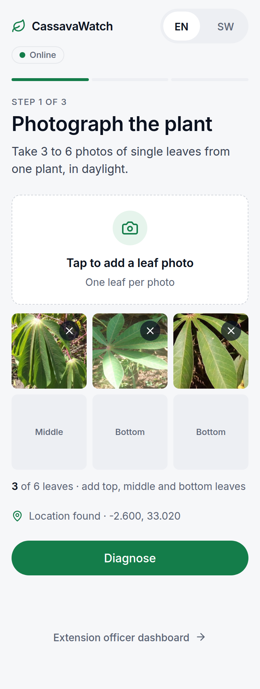
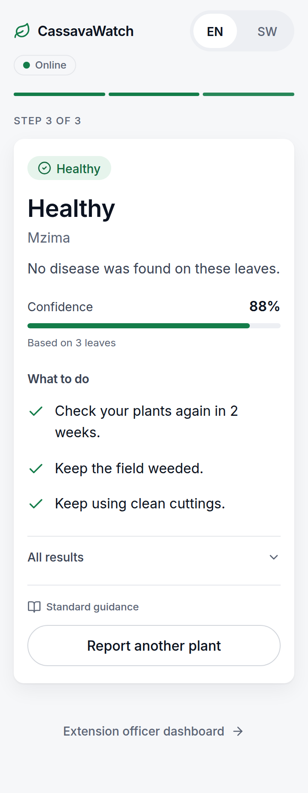
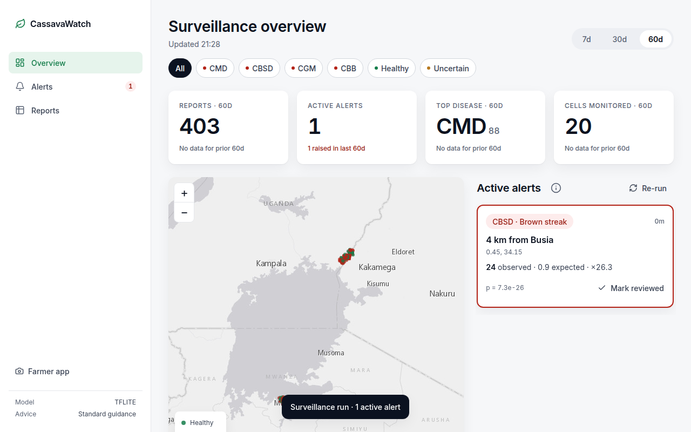

# CassavaWatch

Mobile-first web app for cassava disease diagnosis and denominator-aware disease surveillance.

- **Farmers / extension officers** (`/`) photograph 3–6 leaves of **one plant**. They get a plant-level
  diagnosis (CBB, CBSD, CGM, CMD or healthy) with treatment advice in **English or Swahili**. If the
  model is unsure they get "uncertain, ask an extension officer" instead. Reports are geotagged. If the
  phone is offline, reports are queued in `localStorage` and synced when it reconnects.
- **Extension officers** (`/dashboard`) see a Leaflet map of reports coloured by disease, red rectangles
  for **anomaly alerts** on a 0.1° grid, and a table of active alerts with a *Mark reviewed* button.

 



## Quick start

Prerequisites: Linux/macOS with `make`, [`uv`](https://docs.astral.sh/uv/) (it fetches Python 3.11
itself) and internet access for the first install. The runtime install is about 270 MB and runs the
model with `tflite-runtime`. Full TensorFlow is only needed for training (`make setup-train`).

```bash
make setup      # uv venv (Python 3.11) + pip install -r requirements.txt
make test       # pytest (19 tests)
make seed       # ~400 synthetic reports around Busia (KE) and Mwanza (TZ) + one injected CBSD spike
make run        # http://localhost:8000/  (farmer)   http://localhost:8000/dashboard  (officer)
```

The trained model (`models/cassava.tflite`) is committed, so you only need to retrain to change it:

```bash
make setup-train  # adds tensorflow-cpu + tensorflow-datasets (requirements-train.txt)
make fetch      # balanced iCassava subsample via HTTP range requests (~240 MB) -> data/icassava/
make train      # train + export .keras/.tflite + models/eval.json (about 3 min on CPU)
```

The SQLite database is `./cassavawatch.db` (override with `DATABASE_URL` or `CASSAVAWATCH_DB`). With
`SEED_DEMO_DATA=true` an empty database is seeded automatically on boot. It is created on first
start and wiped and refilled by `make seed`. Mobile browsers only allow geolocation over HTTPS or on
`localhost`. When it is unavailable, the app shows a manual district picker.

**End-to-end check** (headless Chrome, with the server running and the database seeded):
`uv pip install playwright && python scripts/e2e_playwright.py`. This runs 19 checks and rewrites
`docs/screenshots/`. Note that it marks the seeded alert as reviewed, so run `make seed` afterwards.

## 60-second demo script

1. `make seed && make run`, then open **http://localhost:8000/** in a phone-sized window (360×740).
2. Tap **EN/SW** to show that the whole page switches language. Leave it on **EN**.
3. Tap **📷 Take photo** and pick 3 leaf photos, for example from `data/icassava/test/healthy/`. The
   counter reads "3 / 6 leaves — good".
4. If location is blocked, choose **Busia (KE)** in the district picker. Tap **Diagnose this plant**.
5. The progress bar moves to **2 Diagnosing**, then **3 Result**. The card shows a green/red/amber
   header, the name in English and Swahili, a one-line explanation and 3–4 action bullets.
   Tap **SW** to show the card in Swahili.
6. Tap **Extension officer dashboard →**. The strip reads "1 active alert" and "CBSD".
7. Click the **CBSD** row ("4 km from Busia"). The map zooms to the red cell and the popup shows
   observed 24 against expected 0.9.
8. Open **ⓘ How alerts work** and explain baseline against observed. Point at the Mwanza "field day"
   village: many reports, but no alert.
9. Click **Run surveillance** (still 1 alert), then **Review**. The alert leaves the active list and
   the "No active alerts" empty state appears.

## Surveillance: why not hotspot clustering

`app/surveillance.py`. Clustering raw report density (DBSCAN/KDE) mostly finds places where there are
many *reporters*, not places with more disease. Instead, for every (0.1° cell, disease):

| quantity | definition |
|---|---|
| observed | positive reports, last 7 days |
| baseline rate | (positives + 1) / (total reports + 5) in the same cell, days 8–60 (Laplace-smoothed) |
| expected | baseline rate × total reports in the cell, last 7 days |
| alert if | observed ≥ 5 **and** Poisson P(X ≥ observed \| expected) < 0.01 **and** observed/expected ≥ 2 |

Reports with confidence < 0.55 are ignored. Because the denominator is the cell's own report volume, a
"field day" that produces 10× the usual number of reports at the usual disease mix does **not** alert.
`tests/test_surveillance.py` has a regression test for this, and the seeded demo includes such a
village near Mwanza. Endemic CMD/CBSD is absorbed by each cell's own baseline. The detector runs after
every new report and on `POST /api/surveillance/run`.

## API

| method | path | |
|---|---|---|
| POST | `/api/diagnose` | multipart: `images` (1–8), `lat`, `lon`, `lang` (en/sw), `device_id`, optional `model` (Qwen model override). Returns plant diagnosis, `advice` + `advice_all` (en/sw; each has `source`: `llm`/`template`), `single_leaf_unreliable`. 400 for non-images, 503 if no model |
| GET | `/api/reports?days=60` | reports |
| GET | `/api/alerts?status=active` | alerts (`active`/`reviewed`/`resolved`/`all`) with Leaflet bounds |
| POST | `/api/alerts/{id}/review` | mark reviewed |
| POST | `/api/surveillance/run` | rerun detector |
| GET | `/api/summary` | dashboard summary strip |
| GET | `/api/config` | advisory mode (`llm`/`template`), current Qwen model, model backend |
| GET | `/health` | status + which model backend is loaded |

## AI-assisted advice (optional, Qwen)

With `QWEN_API_KEY` set, `app/llm_advisory.py` asks a Qwen model (through ModelScope's OpenAI-compatible
endpoint) to rewrite the standard advice as 3–4 plain-language bullets in the farmer's language. The
template advice from `app/advisory.py` goes into the prompt as grounding, so the model refines it rather
than inventing its own. Responses are cached in memory for 1 hour per (disease, language, confidence
bucket, model). Every call logs its source and latency.

This layer is optional. If there is no key, `ADVISORY_MODE=template` is set, the call times out
(`QWEN_TIMEOUT_S`, default 8 s) or anything else goes wrong, the app silently uses the template advice.
Diagnosis never depends on the LLM. The result card shows **Advice: AI-assisted (Qwen)** or **Advice:
standard guidance**. For a side-by-side demo, pass e.g. `-F model=Qwen-Ambassador/Qwen3.8-plus` to
`/api/diagnose`. See `.env.example` for all settings.

## Deploy to Render

1. Push the repo to GitHub. In Render go to **New → Blueprint**, pick the repo, and Render reads
   `render.yaml`. That file defines a free Python 3.11 web service with build command
   `pip install -r requirements.txt && python scripts/fetch_model.py`, start command
   `uvicorn app.main:app --host 0.0.0.0 --port $PORT`, and health check `/health`.
2. In the dashboard, set **`QWEN_API_KEY`** (it is marked `sync: false` and is optional; without it the
   app uses standard advice). **Never commit the API key or a `.env` file.** `.env` is gitignored.
3. The model: `models/cassava.tflite` (1.1 MB) is committed, so no action is needed. If you retrain and
   the file grows past about 50 MB, keep it out of git and publish it as a release asset instead:
   `gh release create model-v1 models/cassava.tflite`. Then set `MODEL_URL` to
   `https://github.com/<owner>/<repo>/releases/download/model-v1/cassava.tflite`.
   `scripts/fetch_model.py` downloads it at build time and skips the download if the file is already
   present. With no model at all, the app still deploys: the dashboard works and `/api/diagnose`
   returns 503 with a clear message.
4. Free-tier caveats:
   - The service sleeps after about 15 minutes idle, so the first request after that takes about 30 s
     (a cold start).
   - The disk is ephemeral, so the SQLite database resets on each deploy or restart. That is fine for a
     demo, because `SEED_DEMO_DATA=true` reseeds synthetic reports and alerts on boot.
   - To keep real reports, switch to the Starter plan and uncomment the `disk:` block in `render.yaml`
     (`cassavawatch-data`, mounted on `data/`).

Runtime inference uses `tflite-runtime`, not TensorFlow, to keep the build small and memory under the
free tier's 512 MB.

## Model

`ml/train.py`: MobileNetV3Small (ImageNet weights, built-in preprocessing, 224 px). It trains the head
with the backbone frozen, then fine-tunes the top 40 backbone layers with BatchNorm kept frozen.
Augmentation: flips, brightness, small rotation. Class weights are capped at 4×. Exports
`models/cassava.keras` and `models/cassava.tflite` (dynamic-range quantized). It also checks that
TFLite and Keras agree on top-1 and writes per-class accuracy plus a confusion matrix to
`models/eval.json`.

**Data** (PlantVillage is deliberately *not* used: it has no cassava and is lab-biased). iCassava 2019
(TFDS `cassava`, field images from Uganda, 5 classes). The full archive is 1.35 GB. On the slow link
used to build this, `ml/fetch_icassava.py` reads the zip's central directory with HTTP Range requests
and pulls only a class-balanced subsample (default 300 train + 100 test per class, about 240 MB)
from the **same archive TFDS builds from**. `train.py` tries these sources in order: local subsample
→ TFDS (12-minute download timeout) → Kaggle 2020 set in `./data/` → synthetic data, which is logged
loudly as `PLACEHOLDER DATA`.

The app loads `cassava.tflite` if it exists, otherwise `cassava.keras`. If neither exists, the app
still starts, `/health` reports `model_backend: "none"` and `/api/diagnose` returns **503** with a
clear message. For UI work without a model, `CASSAVAWATCH_STUB=1` enables a colour-heuristic stub,
which is labelled `backend: "stub"` in responses.

### Metrics

From `models/eval.json`. Data: iCassava 2019 subsample (same archive as tfds:cassava; train=1500, test=500). The held-out test set is class-balanced, 500 images (100 per class). Trained on CPU in 193 s (8 head epochs + 12 fine-tune epochs).

**Overall accuracy: 75.2%** · `.keras` 9.88 MB · **`.tflite` 1.11 MB** · TFLite/Keras top-1 agreement 95% (100 images)

| class | per-class accuracy (recall) |
|---|---|
| cbb | 66% |
| cbsd | 61% |
| cgm | 72% |
| cmd | 83% |
| healthy | 94% |

Confusion matrix (rows = true, columns = predicted):

| | cbb | cbsd | cgm | cmd | healthy |
|---|---|---|---|---|---|
| **cbb** | 66 | 9 | 6 | 2 | 17 |
| **cbsd** | 18 | 61 | 5 | 9 | 7 |
| **cgm** | 10 | 1 | 72 | 11 | 6 |
| **cmd** | 1 | 5 | 5 | 83 | 6 |
| **healthy** | 2 | 4 | 0 | 0 | 94 |

CBSD is the weakest class, which fits its cryptic leaf symptoms. This is single-leaf accuracy; the app averages 3–6 leaves per plant.

## Known limitations

- **Inference runs on the server.** Photos are uploaded and classified by FastAPI. The 1.1 MB
  quantized `models/cassava.tflite` is the path to on-device inference (TFLite on Android or
  TF.js), but it isn't wired in yet. Offline mode queues reports and sends them on reconnect; it
  does not diagnose offline.
- **Classifier accuracy is modest** (`models/eval.json`): 75.2% overall on 500 balanced held-out
  iCassava images. Per class: CMD 83%, CGM 72%, CBB 66%, **CBSD 61%**, healthy 94%. It was trained on
  only 1,500 images from one Ugandan source, so expect lower accuracy on other regions, phones and
  lighting.
- **Single-leaf results are unreliable, especially for CBSD.** Published single-leaf field accuracy
  for cassava ranges from about 20% to 60%. CBSD leaf symptoms are often faint or absent while the
  roots rot. The app averages 3–6 leaves per plant, flags `single_leaf_unreliable` for one-photo
  submissions, and returns "uncertain" when the top probability is below 0.55. A "healthy" result
  does not rule CBSD out.
- **The seed data is synthetic.** `scripts/seed_demo.py` generates the dashboard's reports, and the
  alert shown is an injected CBSD spike, not a real outbreak.
- **The alerts are not validated.** The detector's thresholds (p < 0.01, ratio ≥ 2, ≥ 5 cases,
  0.1° cells, 7-day and 60-day windows) have not been checked against real ground truth. Before any
  operational use, they must be validated against field survey data such as the NaCRRI Uganda CBSD
  surveys or national cassava disease surveillance data.
- There is no authentication or rate limiting, the database is SQLite, and map tiles and Leaflet
  come from public CDNs, so the dashboard map needs internet access. Place labels come from a fixed
  town list, not reverse geocoding.
- Load time: the capture page is 24 KB with no render-blocking scripts. It loads in about 0.45 s at
  150 ms RTT / 1.6 Mbps, and about 1.3 s under DevTools' stricter "Fast 3G" preset (562 ms RTT).
